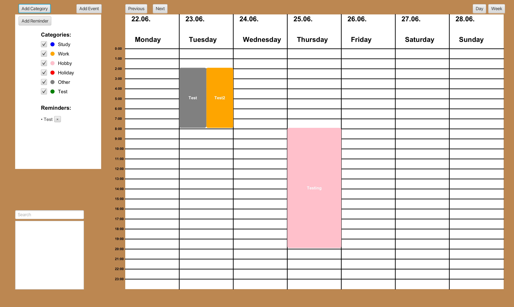
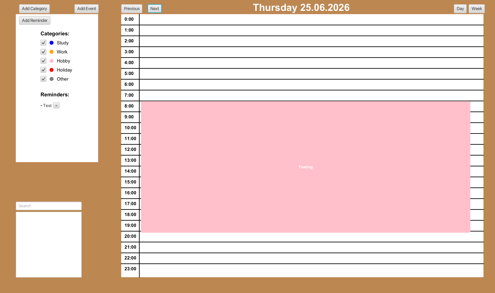
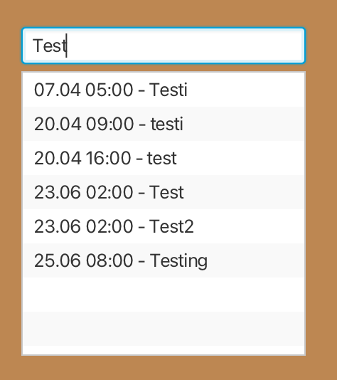

# CalendarApp

A desktop calendar application built with **Scala 3** and **ScalaFX**. It supports
week and day views, color-coded event categories, reminders, search, and reads
and writes the standard **iCalendar (`.ics`)** format, so calendars can be shared
with other apps.

## Features

- **Week and day views** with navigation forward and backward in time.
- **Create events by dragging** across a time range in the day view.
- **Edit and delete** existing events.
- **Color-coded categories** (Study, Work, Hobby, Holiday, Other) with the ability
  to add custom categories and **filter** the calendar by category.
- **Overlapping events render side by side** — events that share a time slot are
  automatically laid out in adjacent columns.
- **Reminders panel** for quick to-dos, persisted between sessions.
- **Search** across event titles, descriptions, and locations.
- **iCalendar import/export** — events are stored in the standard `.ics` format
  using the [ical4j](https://www.ical4j.org/) library.
- **Public holidays** displayed in the calendar (imported from `holidays.ics`).
- **Persistence** — events and reminders are saved to disk and restored on the
  next launch.

## Screenshots

**Week view** — overlapping events are laid out side by side:



**Day view** — a single day broken into hourly slots:



**Search** — find events by title, description, or location:



## Tech stack

- [Scala 3](https://www.scala-lang.org/) (3.3.7)
- [ScalaFX](https://www.scalafx.org/) 23 / [JavaFX](https://openjfx.io/) 21
- [ical4j](https://www.ical4j.org/) 4.0 — iCalendar reading/writing
- [sbt](https://www.scala-sbt.org/) build tool

## Getting started

### Prerequisites

- JDK 17 or newer
- [sbt](https://www.scala-sbt.org/download.html)

### Run

```bash
sbt run
```

sbt resolves the correct JavaFX native binaries for your platform (macOS
Intel/Apple Silicon, Linux, Windows) automatically.

## Project structure

```
src/main/scala/
├── Main.scala            # ScalaFX UI: week/day views, dialogs, reminders, search
├── CalendarManager.scala # Event storage and .ics import/export (ical4j)
├── CalendarEntry.scala   # Abstract base for calendar entries
├── Event.scala           # Timed event with start/end and validation
├── Category.scala        # Named, colored, toggleable category
├── DateUtils.scala       # Date helpers (start of day, Monday of week)
└── EventLayout.scala     # Column layout for overlapping events
```

## Background

Originally built as a course project for *Ohjelmointistudio 2* (Programming
Studio 2) at Aalto University, then cleaned up for general use.
